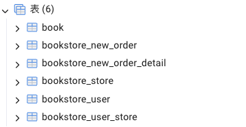
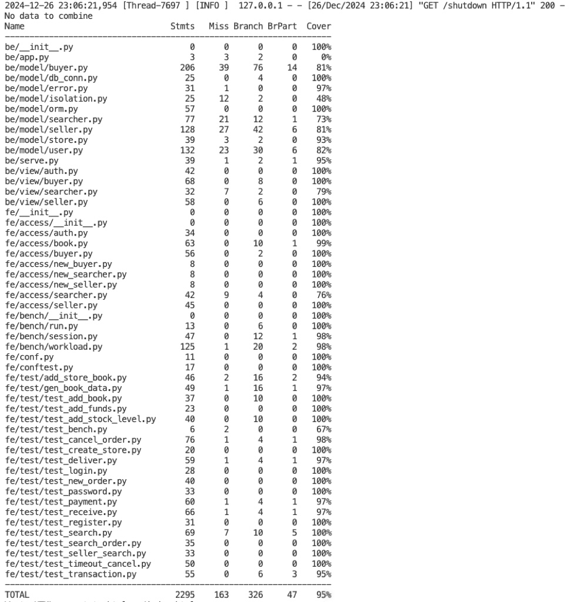
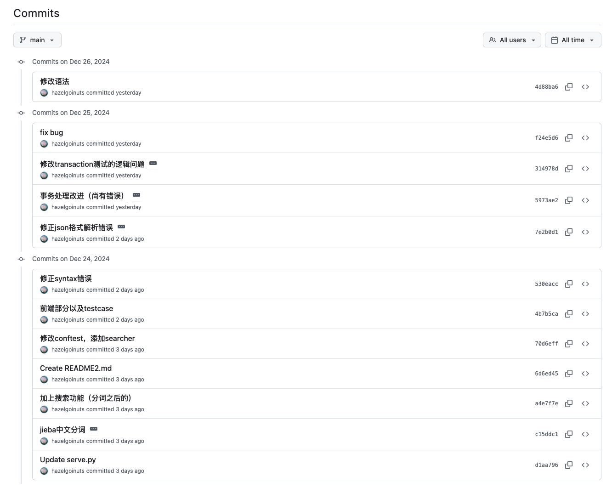
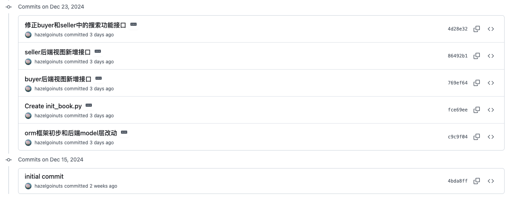

# Bookstore2 实验报告

## 一、项目概述

本项目旨在实现一个提供**网上购书**功能的后端系统。整体架构基于关系型数据库（PostgreSQL）来存储和管理核心业务数据（用户、店铺、图书、订单等），并提供一组可访问的 API 接口，满足**买家**和**卖家**的常见电商场景需求。项目核心特点包括：

1. **买家功能**  
   - 注册、登录、登出和注销账号；  
   - 账户充值操作；  
   - 在任意商店下单购买书籍，并支持订单付款、收货、取消等全流程；  
   - 通过关键字搜索图书，可选择全站或店铺内搜索，并支持分页和中文分词。

2. **卖家功能**  
   - 注册、登录、登出和注销账号；  
   - 创建商店并维护库存：添加新书、增加库存；  
   - 发货操作，当买家已支付后可进行“已发货”处理；  
   - 查询商店订单信息，包括删除超时未支付订单等。

3. **订单流程**  
   - 订单从“未支付”到“已支付”，接着卖家可发货，买家可收货，最终订单状态进入“已收货”或取消；  
   - 同时支持在未支付超过一定时间后自动取消订单，或在已支付状态下进行退款取消（需退还买家余额并扣除卖家余额）。

4. **扩展功能**  
   - **发货 -> 收货**：完善了订单后半程状态变更，使得订单生命周期更完整；  
   - **搜索图书**：基于 PostgreSQL 全文检索 (GIN + TSVECTOR) 及 jieba 分词实现高效中文搜索；  
   - **订单状态 & 查询**：买家可查询历史订单并取消，卖家可查看自家店铺订单；  
   - **超时取消**：对超过指定时限仍未支付的订单自动取消。

5. **技术亮点与选型**  
   - **数据库**：关系型数据库（PostgreSQL），存储用户、订单、店铺等核心数据；  
   - **ORM**：使用 SQLAlchemy 简化数据库操作，同时利于事务管理；  
   - **Web/HTTP 接口**：在 `be/view` 提供统一的 HTTP 入口，结合 `flask` 框架；  
   - **中文搜索**：结合 jieba 分词处理与 PostgreSQL `GIN` 索引来实现标题、标签、简介等字段的文本搜索；  
   - **事务处理**：根据不同业务场景采用 `READ_COMMITTED`、`REPEATABLE_READ` 等隔离级别，保证并发正确性并兼顾性能。

本项目从最初的“**实现一个简单电商后端**”出发，围绕**用户**、**商店**、**图书**、**订单**四大关键实体逐步展开，最后形成了完整的从注册登录到订单全流程处理的系统。与此同时，对**全文搜索**、**事务隔离**和**索引优化**等进阶功能也有深入探索，既保证功能丰富，又在代码设计上保留了**可扩展性**和**可维护性**。

## 二、 关系数据库设计

### 2.1 数据库改动说明及理由

#### 2.1.1 原有数据库结构

原项目使用SQLite的文档型存储方式，其核心表结构如下：

```sql
create table book (
    id TEXT primary key,
    title TEXT,
    author TEXT,
    publisher TEXT,
    original_title TEXT,
    translator TEXT,
    pub_year TEXT,
    pages INTEGER,
    price INTEGER,
    currency_unit TEXT,
    binding TEXT,
    isbn TEXT,
    author_intro TEXT,
    book_intro text,
    content TEXT,
    tags TEXT,
    picture BLOB
);
```

#### 2.1.2 改进后的关系型数据库结构

采用PostgreSQL关系型数据库，对数据结构做了如下改进：

**拆分为多个关联表：**
- **book表**：存储图书的基本信息
    - 如书名、作者、出版社、ISBN等。
- **bookstore_store表**：存储商店与图书的库存信息
    - 包括商店ID、书籍ID、库存数量等。
- **bookstore_user表**：存储用户的基本信息
    - 包括用户ID、密码、余额等。
- **bookstore_user_store表**：存储用户和商店的关联关系
    - 标识哪些用户与哪些商店有关联。
- **bookstore_new_order表**：存储订单信息
    - 包括订单ID、用户ID、商店ID、订单状态、订单时间等。
- **bookstore_new_order_detail表**：存储订单详情
    - 包括每本书的ID、数量和价格。



**表关联设计**

添加了合理的外键约束：
- Store表通过book_id关联Book表
- UserStore表通过user_id关联User表
- NewOrder表通过user_id和store_id关联用户和商店
- NewOrderDetail表通过order_id关联订单

**性能优化**

1. **搜索优化：**

- 分词和索引创建
```python
# 使用jieba进行分词
seg_t = " ".join(jieba.cut(title_str, cut_all=False))
seg_a = " ".join(jieba.cut(author_str, cut_all=False))
seg_ta = " ".join(jieba.cut(tags_str, cut_all=False))
seg_b = " ".join(jieba.cut(book_intro_str, cut_all=False))

# 创建带权重的tsvector
token = setweight(to_tsvector('simple', title), 'A') ||  
        setweight(to_tsvector('simple', tags), 'B') ||
        setweight(to_tsvector('simple', book_intro), 'C') ||
        setweight(to_tsvector('simple', author), 'D')

# 创建GIN索引
CREATE INDEX idx_book_token ON book USING gin(token);
```

```python
# 为Book表添加全文检索索引
token = Column(TSVECTOR)  # 用于全文搜索的token字段
```

- 相关性排序优化
```python
# 使用ts_rank计算相关性得分
rank_score = func.ts_rank(
    Book_model.token,
    func.to_tsquery('simple', search_str)
).label('search_score')

# 按相关性得分排序
query = query.order_by(desc('search_score'))
```

2. **事务处理优化**

- 隔离级别管理
```python
class IsolationLevel(Enum):
    READ_UNCOMMITTED = "READ UNCOMMITTED"
    READ_COMMITTED = "READ COMMITTED"  
    REPEATABLE_READ = "REPEATABLE READ"
    SERIALIZABLE = "SERIALIZABLE"

def set_isolation_level(self, level: IsolationLevel):
    self.session.connection(execution_options={
        "isolation_level": level.value
    })
```

- 不同场景使用不同的事务隔离级别
```python
# 读操作使用READ COMMITTED
with self.get_session(IsolationLevel.READ_COMMITTED) as session:
    # 查询订单
    row_order = session.query(NewOrder_model).filter(...)

# 写操作使用REPEATABLE READ
with self.get_session(IsolationLevel.REPEATABLE_READ) as session:
    # 修改库存
    row_store.stock_level -= count
    session.add(row_store)
```

3. **数据库连接优化**

- 连接池配置
```python
engine = create_engine(
    "postgresql+psycopg2://...",
    pool_size=8,
    max_overflow=16,
    pool_recycle=300,
    pool_pre_ping=True
)
```

- 会话管理
```python
@contextmanager
def get_db_session(self, isolation_level=None):
    session = scoped_session(self.DBSession)
    try:
        if isolation_level:
            session.connection(execution_options={
                "isolation_level": isolation_level.value
            })
        yield session
        session.commit()
    except:
        session.rollback()
        raise
    finally:
        session.remove()
```

**改动理由**
1. **表结构拆分的必要性**
    - 拆分后的多表结构允许通过Store表动态管理不同商店的图书库存，一本书可以在多个商店销售
    - UserStore表的引入使得一个用户可以管理多个商店，实现了M:N的关系映射
    - 订单表的拆分(NewOrder和NewOrderDetail)使得订单主表关注订单状态，而详情表负责记录购买的具体商品，便于后续的订单管理和查询


2. **添加外键约束的作用**

    - Store表通过book_id关联Book表，确保添加的商品必须是在Book表中存在的图书
    - NewOrder表通过user_id和store_id的关联确保订单必须对应到实际的买家和商店
    - 这些约束在数据库层面预防了"订单中包含不存在的商品"或"订单关联到不存在的用户"等数据不一致的情况

3. **全文搜索功能的优化**

    - 原结构中tags是用TEXT类型存储的，需要字符串匹配才能实现搜索，效率低下
    - 现在使用**jieba分词+GIN索引**的方案，可以实现高效的中文搜索
    - 通过给不同字段(标题、标签、简介、作者)设置不同权重，保证搜索结果的相关性排序更符合实际需求
    - 使用ts_rank计算相关性分数，使搜索结果能够按照相关程度排序


4. **事务隔离级别的区分使用**

    - 查询操作(如查看订单)使用READ COMMITTED级别，避免不必要的加锁开销
    - 涉及数据修改的操作(如创建订单、支付)使用REPEATABLE READ级别，防止事务执行期间数据被其他事务修改
    - 这种区分使得系统在保证数据一致性的同时，尽可能地提高并发性能

5. **连接池的配置优化**

    - 设置pool_size和max_overflow，避免频繁创建新连接带来的开销
    - 使用pool_recycle定期回收空闲连接，防止连接资源占用过多
    - pool_pre_ping可以在使用连接前先测试连接是否有效，避免使用到失效连接


### 2.2 ER图


### 2.3 关系模式（SQLAlchemy ORM）

项目使用的是**SQLAlchemy ORM框架**。ORM模型设计很好地支持了项目的各项功能需求，同时利用了SQLAlchemy提供的ORM特性来简化数据库操作。相比直接使用SQL语句，ORM模型让代码更加面向对象，更容易维护和扩展。

下面展示ORM的模型定义（bookstore/be/model/orm.py）

1. **图书表（book）**

```python
class Book(Base):
    __tablename__ = 'book'

    id = Column(Text, primary_key=True)
    title = Column(Text)
    author = Column(Text)
    publisher = Column(Text)
    original_title = Column(Text)
    translator = Column(Text)
    pub_year = Column(Text)
    pages = Column(Integer)
    price = Column(Integer)
    currency_unit = Column(Text)
    binding = Column(Text)
    isbn = Column(Text)
    author_intro = Column(Text)
    book_intro = Column(Text)
    content = Column(Text)
    tags = Column(Text)
    picture = Column(LargeBinary)
    token = Column(TSVECTOR)  # PostgreSQL全文搜索向量
```

2. **用户表（bookstore_user）**

```python
class User(Base):
    __tablename__ = 'bookstore_user'

    # 用户基本信息
    user_id = Column(Text, primary_key=True)
    password = Column(Text, nullable=False)
    balance = Column(Integer, nullable=False)  # 账户余额(分)
    token = Column(Text)     # 登录令牌
    terminal = Column(Text)  # 终端标识
```
    
3. **商店表（bookstore_store）**

```python
class Store(Base):
    __tablename__ = 'bookstore_store'

    store_id = Column(Text, primary_key=True)
    book_id = Column(Text, primary_key=True)
    book_info = Column(Text)
    stock_level = Column(Integer)
```

4. **用户商店关联表（bookstore_user_store）**

```python
class UserStore(Base):
    __tablename__ = 'bookstore_user_store'

    user_id = Column(Text, primary_key=True)
    store_id = Column(Text, primary_key=True)
```

5. **订单表（bookstore_new_order）**

```python
class NewOrder(Base):
    __tablename__ = 'bookstore_new_order'

    order_id = Column(Text, primary_key=True)
    user_id = Column(Text)
    store_id = Column(Text)
    status = Column(Text)      # 订单状态
    time = Column(DateTime)    # 创建时间
```

6. **订单详情表（bookstore_new_order_detail）**

```python
class NewOrderDetail(Base):
    __tablename__ = 'bookstore_new_order_detail'

    order_id = Column(Text, primary_key=True)
    book_id = Column(Text, primary_key=True)
    count = Column(Integer)   # 购买数量
    price = Column(Integer)   # 购买单价(分)
```
**设计特点**

- 使用 Text 类型存储大多数字符串字段，避免长度限制；金额相关字段 (price, balance) 使用 Integer 类型，以分为单位存储；时间字段使用 DateTime 类型，支持时间范围查询

- 单表主键使用 Text 类型的 ID（如user_id, order_id）；关联表使用复合主键（如 Store 表的 store_id + book_id ）

- book 表的 token 字段使用 TSVECTOR 类型，支持 PostgreSQL 的全文搜索；User 表的 balance 字段设置 non-null约束，确保账户余额总是有效值


## 三、 前 60% 功能实现
> 用户权限接口，如注册、登录、登出、注销

> 买家用户接口，如充值、下单、付款

> 卖家用户接口，如创建店铺、填加书籍信息及描述、增加库存


### 3.1 用户基础功能

用户**基础**功能包括：
- **用户注册**：`register`, 新用户注册账号
- **用户登录**：`login`, 用户登录获取token
- **用户登出**：`logout`, 用户登出注销token 
- **修改密码**：`password`, 修改用户密码
- **注销账号**：`unregister`, 注销用户账号

#### 3.1.1 用户注册

1. **API 接口**
    - **请求地址：`POST /auth/register`**
    - **请求参数：**
    ```json
    {
        "user_id": "user_name",
        "password": "password"
    }
    ```
    - **响应状态：**
        | 状态码 | 描述 |
        | --- | --- |
        | 200 | 注册成功 |
        | 512 | 用户ID已存在 |
        | 5XX | 其他错误 |

2. **实现逻辑**
```python
def register(self, user_id: str, password: str):
    try:
        terminal = "terminal_{}".format(str(time.time()))
        token = jwt_encode(user_id, terminal)
        
        with self.get_session() as session:
            new_user = User_model(
                user_id=user_id,
                password=password,
                balance=0,
                token=token,
                terminal=terminal
            )
            session.add(new_user)
    except Exception as e:
        return error.error_exist_user_id(user_id)
        
    return 200, "ok"
```

> **流程总结：**
> - 生成用户终端标识和 token。
> - 开始数据库事务，创建并存储新用户记录（初始余额为 0）。
> - 提交事务，返回注册结果。


3. **数据库操作**
- **表**： bookstore_user
- **操作**：SELECT 用户信

#### 3.1.2 用户登录

1. **API 接口**
    - **请求地址**：`POST /auth/login`
    - **请求参数**：
    ```json
    {
        "user_id": "user_name",
        "password": "password",
        "terminal": "terminal_code"
    }
    ```
    - **响应内容**：
    ```json
    {
        "message": "ok",
        "token": "access_token"
    }
    ```
    - **响应状态**：
        | 状态码 | 描述 |
        | --- | --- |
        | 200 | 登录成功 |
        | 401 | 用户名或密码错误 |
        | 5XX | 其他错误 |

2. **实现逻辑**
```python
def login(self, user_id: str, password: str, terminal: str):
    try:
        # 验证密码
        code, message = self.check_password(user_id, password)
        if code != 200:
            return code, message, ""
        
        # 生成新 token
        token = jwt_encode(user_id, terminal)
        
        with self.get_session() as session:
            user = session.query(User_model).filter(User_model.user_id == user_id).first()
            if not user:
                return error.error_authorization_fail() + ("",)
            
            # 更新用户 token 和终端信息
            user.token = token
            user.terminal = terminal
            session.add(user)
    except Exception as e:
        return 530, str(e), ""
        
    return 200, "ok", token
```

> **流程总结：**
> - 验证用户密码
> - 生成新的登录token
> - 开始数据库事务
>   - 更新用户token和终端信息
> - 提交事务
> - 返回token

3. **数据库操作**
- **表**： bookstore_user
- **操作**： SELECT 用户记录，UPDATE 用户 token 和终端信息。

#### 3.1.3 用户登出

1. **API 接口**
    - **请求地址：`POST /auth/logout`**
    - **请求头：**
        | key | 说明 |
        | --- | --- |
        | token | 访问token |
        
    - **请求参数：**
    ```json
    {
        "user_id": "user_name"
    }
    ```
    - **响应状态：**
        | 状态码 | 描述 |
        | --- | --- |
        | 200 | 登出成功 |
        | 401 | token无效 |
        | 5XX | 其他错误 |

2. **实现逻辑**
```python
def logout(self, user_id: str, token: str):
    try:
        # 验证当前token
        code, message = self.check_token(user_id, token)
        if code != 200:
            return code, message

        # 生成新的dummy token使旧token失效
        terminal = "terminal_{}".format(str(time.time()))
        dummy_token = jwt_encode(user_id, terminal)

        with self.get_session() as session:
            row = session.query(User_model).filter(
                User_model.user_id==user_id
            ).first()
            
            if row is None:
                return error.error_authorization_fail()
            
            # 更新为dummy token
            row.token = dummy_token
            row.terminal = terminal
            session.add(row)

    except Exception as e:
        return 530, "{}".format(str(e))
        
    return 200, "ok"
```

> **流程总结：**
> - 验证当前token有效性
> - 生成新的dummy token
> - 开始数据库事务
>   - 更新用户token信息
> - 提交事务
> - 返回登出结果

3. **数据库操作**
- **表**： bookstore_user
- **操作**： SELECT 用户记录，UPDATE 用户 token 和终端信息。

#### 3.1.4 修改密码

1. **API 接口**
    - **请求地址**：`POST /auth/password`
    - **请求参数**：
    ```json
    {
        "user_id": "user_name",
        "oldPassword": "old_password",
        "newPassword": "new_password"
    }
    ```
    - **响应状态：**
        | 状态码 | 描述 |
        | --- | --- |
        | 200 | 修改成功 |
        | 401 | 原密码错误 |
        | 5XX | 其他错误 |

2. **实现逻辑**
```python
def change_password(self, user_id: str, old_password: str, new_password: str):
    try:
        # 验证原密码
        code, message = self.check_password(user_id, old_password)
        if code != 200:
            return code, message

        # 生成新token
        terminal = "terminal_{}".format(str(time.time()))
        token = jwt_encode(user_id, terminal)

        with self.get_session() as session:
            row = session.query(User_model).filter(
                User_model.user_id==user_id
            ).first()
            
            if row is None:
                return error.error_authorization_fail()

            # 更新密码和token
            row.password = new_password
            row.token = token
            row.terminal = terminal
            session.add(row)
            
    except Exception as e:
        return 530, "{}".format(str(e))
        
    return 200, "ok"
```

> **流程总结：**
> - 验证原密码正确性
> - 生成新的token
> - 开始数据库事务
>   - 更新用户密码
>   - 更新token信息
> - 提交事务
> - 返回操作结果

3. **数据库操作**
- **表**： bookstore_user
- **操作**： SELECT 用户记录，UPDATE 用户 token 和终端信息。

#### 3.1.5 注销账号

1. **API 接口**
    - **请求地址：`POST /auth/unregister`**
    - **请求参数：**
    ```json
    {
        "user_id": "user_name",
        "password": "password"
    }
    ```
    - **响应状态：**
        | 状态码 | 描述 |
        | --- | --- |
        | 200 | 注销成功 |
        | 401 | 密码错误 |
        | 5XX | 其他错误 |

2. **实现逻辑**
```python
def unregister(self, user_id: str, password: str):
    try:
        # 验证密码
        code, message = self.check_password(user_id, password)
        if code != 200:
            return code, message

        with self.get_session() as session:
            row = session.query(User_model).filter(
                User_model.user_id==user_id
            ).first()

            if row is not None:
                # 删除用户记录
                session.delete(row)
            else:
                return error.error_authorization_fail()
                
    except Exception as e:
        return 530, "{}".format(str(e))
        
    return 200, "ok"
```

> **流程总结：**
> - 验证用户密码
> - 开始数据库事务
>   - 查找并删除用户记录
> - 提交事务
> - 返回操作结果

3. **数据库操作**
- **表**： bookstore_user
- **操作**： SELECT 用户记录，DELETE 用户记录。


#### 3.1.6 Token验证
```python
def check_token(self, user_id: str, token: str) -> (int, str):
    with self.get_session() as session:
        row = session.query(User_model.token).filter(
            User_model.user_id==user_id
        ).all()

    if len(row) != 1:
        return error.error_authorization_fail()

    db_token = row[0].token
    
    # 验证token有效性
    try:
        if db_token != token:
            return False
        jwt_text = jwt_decode(encoded_token=token, user_id=user_id)
        ts = jwt_text["timestamp"]
        if ts is not None:
            now = time.time()
            if self.token_lifetime > now - ts >= 0:
                return True
    except jwt.exceptions.InvalidSignatureError as e:
        logging.error(str(e))
        return False
```

> **流程总结：**
> - 从数据库获取存储的token
> - 比对token是否匹配
> - 检查token是否在有效期内

3. **数据库操作**
- **表**： bookstore_user
- **操作**： SELECT 用户 token 信息。

#### 3.1.7 数据库操作总结

用户相关的数据库操作主要涉及 **User 表**：
```python
class User(Base):
    __tablename__ = 'bookstore_user'
    
    user_id = Column(Text, primary_key=True)
    password = Column(Text, nullable=False)
    balance = Column(Integer, nullable=False)
    token = Column(Text)
    terminal = Column(Text)
```

主要的数据库操作包括：
1. 用户创建：INSERT 操作写入新用户数据
2. 用户认证：SELECT 操作查询用户密码和 token
3. 状态更新：UPDATE 操作更新用户 token 和终端信息
4. 用户注销：DELETE 操作删除用户数据


### 3.2 买家功能

买家**基础**功能包括：

- **创建订单**：`new_order`, 买家选择商品下单
- **订单支付**：`payment`, 使用账户余额支付订单
- **账户充值**：`add_funds`, 为账户添加余额


#### 3.2.1 创建订单

1. **API 接口**

    - **请求地址：`POST /buyer/new_order`**
    - **请求参数：**
    ```json
    {
        "user_id": "buyer_id",
        "store_id": "store_id",
        "books": [
        {
            "id": "book_id",
            "count": 1
        }
        ]
    }
    ```

    - **响应状态：**
    
        | 状态码 | 描述 |
        | --- | --- |
        | 200 | 下单成功 |
        | 511 | 买家用户ID不存在 |
        | 513 | 商铺ID不存在 |
        | 515 | 购买的图书不存在 |
        | 517 | 商品库存不足 |

- - - 
2. **实现逻辑**
    > 详见 `be/model/buyer.py` 中的 `new_order` 方法

    ```python
    def new_order(self, user_id: str, store_id: str, id_and_count: List[Tuple[str, int]]):
        order_id = ""
        try:
            # 验证买家和店铺存在性
            if not self.user_id_exist(user_id):
                return error.error_non_exist_user_id(user_id) + (order_id,)
            # ... 其他验证检查 ...

            # 生成唯一订单ID
            order_id = f"{user_id}_{store_id}_{uuid.uuid1()}"
        
            # 使用REPEATABLE READ隔离级别处理订单创建
            with self.get_session(IsolationLevel.REPEATABLE_READ) as session:
                # 遍历订单中的每本书
                for book_id, count in id_and_count:
                    # 检查库存并扣减
                    store_entry = session.query(Store_model).filter(/* 查询条件 */).first()
                    # ... 库存检查和扣减逻辑 ...
                
                    # 创建订单详情记录
                    order_detail = NewOrderDetail_model(/* 订单详情相关参数 */)
                    session.add(order_detail)
            
                # 创建主订单记录
                new_order = NewOrder_model(/* 订单基本信息 */)
                session.add(new_order)

        except Exception as e:
            return 530, str(e), ""
    
        return 200, "ok", order_id
    ```
    > **流程总结：**
    > - 验证用户和商店是否存在
    > - 生成订单ID
    > - 开始数据库事务
    >   - 对于每本书:
    >     - 检查库存
    >     - 扣减库存
    >     - 添加订单详情
    >   - 创建订单
    > - 提交事务
    > - 返回订单ID
- - - 
3. **数据库操作**
- **表**： bookstore_store, new_order_detail, new_order
- **操作**： SELECT 店铺和图书记录，UPDATE 库存，INSERT 订单和订单详情记录。

- - -
#### 3.2.2 订单支付

1. **API 接口**

    - **请求地址：`POST /buyer/payment`**
    - **请求参数：**
    ```json
    {
        "user_id": "buyer_id",
        "order_id": "order_id",
        "password": "password"
    }
    ```

    - **响应状态：**

        | 状态码 | 描述 |
        | --- | --- |
        | 200 | 支付成功 |
        | 519 | 余额不足 |

- - -
2. **实现逻辑**
    > 详见 `be/model/buyer.py` 中的 `payment` 方法
    ```python
    def payment(self, user_id: str, password: str, order_id: str):
        try:
            # 第一阶段：查询订单信息（READ COMMITTED）
            with self.get_session(IsolationLevel.READ_COMMITTED) as session:
                # 查询订单并验证所属关系
                order = session.query(NewOrder_model).filter(/* 查询条件 */).first()
                # ... 订单验证逻辑 ...
            
                # 计算订单总价
                order_details = session.query(NewOrderDetail_model).filter(/* 查询条件 */).all()
                total_price = /* 计算总价逻辑 */
        
            # 第二阶段：执行支付（REPEATABLE READ）
            with self.get_session(IsolationLevel.REPEATABLE_READ) as session:
                # 检查用户余额
                user = session.query(User_model).filter(/* 查询条件 */).first()
                # ... 余额检查逻辑 ...
            
                # 扣减余额并更新订单状态
                user.balance -= total_price
                order.status = "已支付"
                session.add(user)
                session.add(order)

        except SQLAlchemyError as e:
            return 528, str(e)
    
        return 200, "ok"
    ```
    > **流程总结：**
    > - 查询订单信息
    >   - 验证订单和用户的有效性
    > - 计算订单总价
    > - 执行支付操作
    >   - 检查用户余额
    >   - 扣减余额
    >   - 更新订单状态为已支付
    > - 返回支付结果
- - -

3. **数据库操作**

- **表**： new_order, new_order_detail, bookstore_user
- **操作**： SELECT 订单和订单详情，UPDATE 用户余额和订单状态。

- - -
#### 3.2.3 充值

1. **API 接口**

    - **请求地址：`POST /buyer/add_funds`**
    - **请求参数：**
    ```json
    {
        "user_id": "user_id",
        "password": "password",
        "add_value": 10
    }
    ```

    - **响应状态：**

        | 状态码 | 描述 |
        | --- | --- |
        | 200 | 充值成功 |
        | 401 | 授权失败 |
        | 5xx | 其他错误 |

2. **实现逻辑**
    > 详见 `be/model/buyer.py` 中的 `add_funds` 方法
    ```python
    def add_funds(self, user_id: str, password: str, add_value: int):
        try:
            # 使用REPEATABLE READ隔离级别处理充值
            with self.get_session(IsolationLevel.REPEATABLE_READ) as session:
                # 查询用户并验证密码
                user = session.query(User_model).filter(/* 查询条件 */).first()
                # ... 用户验证逻辑 ...
            
                # 增加用户余额
                user.balance += add_value
                session.add(user)

        except SQLAlchemyError as e:
            return 528, str(e)
        except Exception as e:
            return 530, str(e)
    
        return 200, "ok"
    ``` 

    > **流程总结：**
    > - 开始数据库事务
    > - 查询用户信息
    >   - 验证用户是否存在
    >   - 验证密码是否正确
    > - 增加用户余额
    > - 提交事务
    > - 返回操作结果

3. **数据库操作**
- **表**： bookstore_user
- **操作**： SELECT 用户记录，UPDATE 用户余额。

---
### 3.3 卖家功能

卖家**基础**功能包括：
- **创建店铺**：`create_store`, 卖家创建新的店铺
- **添加书籍**：`add_book`, 为店铺添加新的图书商品
- **增加库存**：`add_stock_level`, 增加已有图书的库存数量

#### 3.3.1 创建店铺
1. **API 接口**
    - **请求地址：`POST /seller/create_store`**
    - **请求头：**
        | key | 说明 |
        | --- | --- |
        | token | 访问token |
        
    - **请求参数：**
    ```json
    {
        "user_id": "seller_id",
        "store_id": "store_id"
    }
    ```
    - **响应状态：**
        | 状态码 | 描述 |
        | --- | --- |
        | 200 | 创建成功 |
        | 511 | 卖家用户ID不存在 |
        | 514 | 店铺ID已存在 |
        | 5XX | 其他错误 |
---
2. **实现逻辑**
    > 详见 `be/model/seller.py` 中的 `create_store` 方法

    ```python
    def create_store(self, user_id: str, store_id: str):
        try:
            # 验证卖家存在性和店铺唯一性
            if not self.user_id_exist(user_id):
                return error.error_non_exist_user_id(user_id)
            # ... 其他验证检查 ...
        
            # 使用REPEATABLE READ隔离级别创建店铺
            with self.get_session(IsolationLevel.REPEATABLE_READ) as session:
                # 创建用户-商店关联记录
                new_store = UserStore_model(/* 用户和店铺ID */)
                session.add(new_store)

        except SQLAlchemyError as e:
            return 528, str(e)
        except Exception as e:
            return 530, str(e)
    
        return 200, "ok"
    ```

    > **流程总结：**
    > - 验证卖家用户存在性
    > - 验证店铺ID未被使用
    > - 使用REPEATABLE READ隔离级别开始事务
    >   - 创建商店记录
    >   - 建立用户与商店的关联
    > - 提交事务
    > - 返回创建结果

3. **数据库操作**
- **表**： bookstore_user_store, user_store
- **操作**： SELECT 用户和店铺记录，INSERT 新店铺记录。
---
#### 3.3.2 添加书籍

1. **API 接口**
    - **请求地址：`POST /seller/add_book`**
    - **请求头：**
        | key | 说明 |
        | --- | --- |
        | token | 访问token |
        
    - **请求参数：**
    ```json
    {
        "user_id": "seller_id",
        "store_id": "store_id",
        "book_info": {
            "id": "book_id",
            "title": "title",
            "author": "author",
            "price": 1000,
            ...
        },
        "stock_level": 10
    }
    ```
    - **响应状态：**
        | 状态码 | 描述 |
        | --- | --- |
        | 200 | 添加成功 |
        | 511 | 卖家用户ID不存在 |
        | 513 | 店铺ID不存在 |
        | 516 | 图书ID已存在 |
        | 5XX | 其他错误 |
---
2. **实现逻辑**
    > 详见 `be/model/seller.py` 中的 `add_book` 方法
    ```python
    def add_book(self, user_id: str, store_id: str, book_id: str, book_json_str: str, stock_level: int):
        try:
            # 验证卖家用户、店铺存在性和图书唯一性
            if not self.user_id_exist(user_id):
                return error.error_non_exist_user_id(user_id)
                # ... 其他验证检查 ...
        
            # 使用REPEATABLE READ隔离级别添加图书
            with self.get_session(IsolationLevel.REPEATABLE_READ) as session:
                # 创建新的Store记录，包含store_id, book_id等必要信息
                new_store_entry = Store_model(/* store和book的相关参数 */)
                session.add(new_store_entry)
                # 事务提交...

        except SQLAlchemyError as e:
            return 528, str(e)
        except Exception as e:
            return 530, str(e)
    
        return 200, "ok"
    ```

    > **流程总结：**
    > - 验证卖家用户和店铺存在性
    > - 验证图书在该店铺中不存在
    > - 使用REPEATABLE READ隔离级别开始事务
    >   - 创建图书库存记录
    >   - 存储图书信息
    > - 提交事务
    > - 返回添加结果
---
3. **数据库操作**
- **表**： bookstore_store
- **操作**： INSERT 新图书库存记录。
---
#### 3.3.3 增加库存

1. **API 接口**
    - **请求地址：`POST /seller/add_stock_level`**
    - **请求头：**
        | key | 说明 |
        | --- | --- |
        | token | 访问token |
        
    - **请求参数：**
    ```json
    {
        "user_id": "seller_id",
        "store_id": "store_id",
        "book_id": "book_id",
        "add_stock_level": 10
    }
    ```
    - **响应状态：**
        | 状态码 | 描述 |
        | --- | --- |
        | 200 | 增加成功 |
        | 511 | 卖家用户ID不存在 |
        | 513 | 店铺ID不存在 |
        | 515 | 图书ID不存在 |
        | 5XX | 其他错误 |
---
2. **实现逻辑**
    > 详见 `be/model/seller.py` 中的 `add_stock_level` 方法
    ```python
    def add_stock_level(self, user_id: str, store_id: str, book_id: str, add_stock_level: int):
        try:
            # 验证卖家用户、店铺和图书存在性
            if not self.user_id_exist(user_id):
                return error.error_non_exist_user_id(user_id)
            # ... 其他验证检查 ...
        
            # 使用REPEATABLE READ隔离级别更新库存
            with self.get_session(IsolationLevel.REPEATABLE_READ) as session:
                # 查询并验证库存记录
                store_entry = session.query(Store_model).filter(/* 查询条件 */).first()
            
                # 更新库存
                store_entry.stock_level += add_stock_level
                session.add(store_entry)

        except SQLAlchemyError as e:
            return 528, str(e)
        except Exception as e:
            return 530, str(e)
    
        return 200, "ok"
    ```

    > **流程总结：**
    > - 验证卖家用户、店铺和图书的存在性
    > - 使用REPEATABLE READ隔离级别开始事务
    >   - 查询当前库存
    >   - 增加库存数量
    > - 提交事务
    > - 返回操作结果
---
3. **数据库操作**
- **表**： bookstore_store
- **操作**： SELECT 图书库存记录，UPDATE 库存数量。


## 四、 后 40% 功能实现

在实际场景中，在线购买书籍的过程却远远比这复杂许多。为了更好地模拟真实的电商场景，需要额外实现一些功能。

新增**书籍发货功能、书籍的收货功能、书籍搜索功能、订单的查询**这四个额外的功能模块。


### 4.1 发货 & 收获功能

> - **发货**：`delivered`，是**卖家**将已购买的书籍发送给**买家**的过程。
> - **收货**：`received`，是**买家**收到已发货的订单的过程。

> 这两个功能紧密相关，共同构成了订单从支付后到完成的完整流程。订单状态的变化为：**已支付 -> 已发货 -> 已收货**。

#### 4.1.1 订单发货

1. **API 接口**
    - **请求地址：`POST /seller/delivered`**
    - **请求参数：**
    ```json
    {
        "user_id": "user_id",
        "order_id": "order_id"
    }
    ```
    - **响应状态：**
        | 状态码 | 描述 |
        | --- | --- |
        | 200 | 发货成功 |
        | 401 | 权限错误，非订单对应卖家 |
        | 518 | 订单不存在 |
        | 520 | 订单状态不允许发货 |
---
2. **实现逻辑**
    > 详见 `be/model/seller.py` 中的 `delivered` 方法
    ```python
    def delivered(self, user_id: str, order_id: str):
        try:
            # 使用READ COMMITTED隔离级别处理发货
            with self.get_session(IsolationLevel.READ_COMMITTED) as session:
                # 查询订单基本信息
                order = session.query(NewOrder_model).filter(/* 订单ID条件 */).first()
                if not order:
                    return error.error_invalid_order_id(order_id)

                # 验证卖家权限
                seller = session.query(UserStore_model).filter(/* 店铺和用户关联条件 */).first()
                # ... 权限验证逻辑 ...

                # 检查订单状态
                if order.status != "已支付":
                    return error.error_status_not_allowed(order_id)

                # 更新订单状态为已发货
                order.status = "已发货"
                session.add(order)

        except SQLAlchemyError as e:
            return 528, str(e)
        return 200, "ok"
    ```

    > **流程总结：**
    > - 查询并验证订单信息
    > - 验证卖家身份权限
    > - 检查订单状态必须为"已支付"
    > - 更新订单状态为"已发货"
    > - 使用READ_COMMITTED隔离级别确保数据一致性
---
3. **数据库操作**
- **表**： new_order, user_store
- **操作**： SELECT 订单和用户店铺关系，UPDATE 订单状态

---
#### 4.1.2 订单收货

1. **API 接口**
    - **请求地址：`POST /buyer/received`**
    - **请求参数：**
    ```json
    {
        "user_id": "user_id",
        "order_id": "order_id"
    }
    ```
    - **响应状态：**
        | 状态码 | 描述 |
        | --- | --- |
        | 200 | 收货成功 |
        | 401 | 权限错误，非订单对应买家 |
        | 518 | 订单不存在 |
        | 520 | 订单状态不允许收货 |
---
2. **实现逻辑**
    > 详见 `be/model/buyer.py` 中的 `received` 方法
    ```python
    def received(self, user_id: str, order_id: str):
        try:
            # 使用REPEATABLE READ隔离级别处理收货
            with self.get_session(IsolationLevel.REPEATABLE_READ) as session:
                # 查询订单信息
                order = session.query(NewOrder_model).filter(/* 订单ID条件 */).first()
                if order is None:
                    return error.error_invalid_order_id(order_id)

                # 验证买家身份
                if order.user_id != user_id:
                    return error.error_authorization_fail()

                # 检查并更新订单状态
                if order.status == "已发货":
                    order.status = "已收货"
                    session.add(order)
                else:
                    return error.error_status_not_allowed(order_id)

        except SQLAlchemyError as e:
            return 528, str(e)
        except Exception as e:
            return 530, str(e)

        return 200, "ok"
    ```

    > **流程总结：**
    > - 查询并验证订单信息
    > - 验证买家身份权限
    > - 检查订单状态必须为"已发货"
    > - 更新订单状态为"已收货"
    > - 使用REPEATABLE_READ隔离级别确保数据一致性

- - -

3. **数据库操作**
- **表**： new_order
- **操作**： SELECT 订单信息，UPDATE 订单状态

- - -
### 4.2 书籍搜索功能

> 该功能的核心位于 `be/model/searcher.py` 及其依赖脚本 `tokenization/tokenization.py`。通过对书籍数据进行**中文分词**、**PostgreSQL 全文搜索**（GIN 索引、TSVector）以及**权重配置**等操作，实现了搜索结果的准确匹配和高效查询。同时，通过**分页机制**可以方便地展示大批量搜索结果。

> **关键优化在于**
> - 使用jieba分词提高中文搜索准确性
> - PostgreSQL的全文搜索功能(GIN索引、tsvector等)
> - 设置不同字段的搜索权重
> - 分页机制的实现


#### 4.2.1 预处理步骤

1. **分词与索引创建** 
    > 详见 `tokenization/tokenization.py` 中的 `init_database` 方法

    在进行搜索之前，需要先为数据库中的书籍建立额外的搜索字段(`token`)及索引。本实验使用 [jieba](https://github.com/fxsjy/jieba) 对书名、作者、标签、简介等字段进行**中文分词**，再将分词结果写入 `tsvector` 类型的 `token` 列；最后，基于该列创建 GIN 索引，以加速全文检索。

    ```python
    def init_database(engine):
        with engine.connect() as conn:
            # 添加 token 字段
            conn.execute(text("""
                ALTER TABLE book 
                ADD COLUMN IF NOT EXISTS token tsvector;
            """))
            # 建立 GIN 索引
            conn.execute(text("""
                CREATE INDEX IF NOT EXISTS idx_book_token 
                ON book 
            USING gin(token);
        """))

    def main():
        # 1. 初始化数据库及 session
        engine = create_engine(...)
        init_database(engine)
        session = sessionmaker(bind=engine)()

        # 2. 查询书籍信息 (title, author, tags, book_intro)
        res = session.query(
            book_model.id,
            book_model.title,
            book_model.author,
            book_model.tags,
            book_model.book_intro
        ).all()

        # 3. 分词处理
        for row in res:
            # 用 jieba.cut(...) 获得拆分词并用空格拼接
            seg_t = " ".join(jieba.cut(...))

        # 4. 更新 token 字段
        update_sql = text("""
            UPDATE book
            SET token = setweight(to_tsvector('simple', :title), 'A')
                    || setweight(to_tsvector('simple', :tags), 'B')
                    || setweight(to_tsvector('simple', :book_intro), 'C')
                    || setweight(to_tsvector('simple', :author), 'D')
            WHERE id = :book_id
        """)
        # 批量执行并提交事务...
    ```

    **关键步骤**
    - **新增 token 字段**：通过 ALTER TABLE ... ADD COLUMN token tsvector。
    - **创建 GIN 索引**：在 token 列上建立全文索引以提升搜索效率。
    - **jieba 分词**：对标题(title)、作者(author)、标签(tags)、简介(book_intro)等字段进行中文分词并拼接。
    - **写入 token**：将分词结果转换为 to_tsvector('simple', ...) 并赋给 token 列。
    - **事务提交**：最终将改动同步到数据库中，供后续搜索使用。

- - - 
2. **权重分配**

    在 `UPDATE book ... SET token = ...` 这一步，分别使用了 `setweight(..., 'A')、setweight(..., 'B')`、`setweight(..., 'C')`、`setweight(..., 'D')` 对分词内容赋予不同权重。一般而言，“书名”比“标签”或“简介”更需要高优先级，故在本实验中按照以下方式：
    - **A(1.0)**：书名 (title)
    - **B(0.4)**：标签 (tags)
    - **C(0.2)**：简介 (book_intro)
    - **D(0.1)**：作者 (author)

    这使得搜索引擎在计算匹配度时，会更偏向与书名匹配的结果，从而优化搜索质量。
- - -
3. **分页机制**
    > 详见 `be/model/searcher.py` 中的 `_paginate_results` 方法
    
    在完成分词和索引后，我们便可使用 PostgreSQL 的 `to_tsquery / @@ `等函数进行全文搜索。为了避免一次性加载大量搜索结果，通常需要进行分页管理。本实验在后端 (`be/model/searcher.py`) 里提供了一个 `_paginate_results` 函数示例：

    ```python
    def _paginate_results(self, results: List, page: int = 1) -> SearchResult:
        # 计算总页数
        total_items = len(results)
        total_pages = (total_items + self.PAGE_SIZE - 1) // self.PAGE_SIZE
    
        # 切片获取当前页内容
        start_idx = (page - 1) * self.PAGE_SIZE
        end_idx = min(start_idx + self.PAGE_SIZE, total_items)
        current_page_items = results[start_idx:end_idx]
    
        return SearchResult(total_pages, results, current_page_items)
    ```
    - **计算总页数**：`total_pages = (总结果数 + PAGE_SIZE - 1) // PAGE_SIZE`。
    - **切片获取当前页**：根据 page 参数截取本页范围的记录。
    - **返回分页结构**：包含 `total_pages`、全部结果 `all_records`、以及当前页数据 `current_page_items`。

    前端或调用端可在第一次搜索时获得 `total_pages` 并决定是否继续加载后续页；当用户点击下一页时，再发起类似 `show_page(...)` 的请求来获取所需内容。

- - -
#### 4.2.2 图书搜索

在实现了上述预处理功能后，我们便可以进行图书搜索了。

1. **API 接口**
    - **请求地址**：`POST /searcher/search`
    - **请求参数**：
    ```json
    {
        "user_id": "user_id",
        "store_id": "store_id", 
        "keyword": "search_keyword",
        "page": 1
    }
    ```

    - **响应状态**：
        | 状态码 | 描述 |
        | --- | --- |
        | 200 | 搜索成功 |
        | 511 | 用户不存在 |
        | 513 | 店铺不存在 |
        | 522 | 未找到相关结果 |

- - -
2. **实现逻辑**
    > 详见 `be/model/searcher.py` 中的 `search` 方法
    ```python
    def search(self, user_id: str, store_id: str, keyword: str, is_test: bool = True):
        try:
            # 验证用户和店铺
            if not self.user_id_exist(user_id):
                return error.error_non_exist_user_id(user_id)
            if store_id and not self.store_id_exist(store_id):
                return error.error_non_exist_store_id(store_id)

            with self.get_session() as session:
                # 构建搜索子查询
                subquery = self._build_search_subquery(keyword, session)
            
                # 构建主查询
                main_query = self._build_main_query(subquery, store_id, session)
                results = main_query.all()

                if not results:
                    return error.error_non_exist_search()

                # 分页处理
                sr = self._paginate_results(results, page=1)
            
                return 200, sr.total_pages, sr.all_records, sr.current_page

        except SQLAlchemyError as e:
            return 528, 0, [], []
        except Exception as e:
            return 530, 0, [], []
    ```
    > **流程总结**
    > - 验证用户和店铺存在性
    > - 对搜索关键词进行分词处理
    > - 构建搜索子查询(计算相关性得分)
    > - 执行主查询获取结果
    > - 对结果进行分页处理
    > - 返回搜索结果

- - -
3. **数据库操作**
- **表**：book, store
- **操作**：用全文搜索索引查询；关联查询确保库存大于0；按相关性得分排序

- - -
### 4.3 订单查询功能

> - 买家可以查询自己的所有历史订单(`be/model/buyer.py `中的 `search_order` 函数)
> - 卖家可以查询自己的所有历史订单(`be/model/seller.py `中的 `seller_search` 函数)

#### 4.3.1 买家查询订单

> **目标**：买家查看**自己的**历史订单，包括订单状态、时间、详情等。

1. **API 接口**
    - **请求地址：** `POST /buyer/search_order`
    - **请求参数：**
      ```json
      {
          "user_id": "buyer_id"
      }
      ```
    - **响应状态：**
      | 状态码 | 描述                           |
      | ------ | ------------------------------ |
      | 200    | 查询成功                       |
      | 521    | 用户无订单或查询结果为空       |
      | 518    | 某些订单记录无效或不存在       |
      | 5XX    | 其他错误                       |
---
2. **实现逻辑**
    > 详见 `be/model/buyer.py` 中的 `search_order` 方法
   ```python
   def search_order(self, user_id: str):
        try:
            # 第一次查询：获取所有订单基本信息
            with self.get_session() as session:
                orders = session.query(
                    NewOrder_model.order_id,
                    NewOrder_model.store_id,
                    NewOrder_model.status,
                    NewOrder_model.time
                ).filter(NewOrder_model.user_id == user_id).all()

                if not orders:
                    return error.error_user_no_order(user_id) + ("",)

            # 设置订单超时时间（1秒）
            out = timedelta(seconds=1)

            # 第二次查询：处理超时订单并组装返回数据
            with self.get_session() as session:
                order_list = []
                for order in orders:
                    # 检查未支付订单是否超时
                    if order.status == "未支付" and \
                    (datetime.now() - order.time) >= out:
                        # 删除超时订单
                        session.query(NewOrder_model).filter(/* 条件 */).delete()
                        session.query(NewOrderDetail_model).filter(/* 条件 */).delete()
                        continue

                    # 查询订单详情并组装数据
                    details = session.query(NewOrderDetail_model).filter(/* 条件 */).all()
                    # ... 组装订单信息 ...
                    order_list.append(/* 订单数据 */)

                return 200, "ok", order_list

        except Exception as e:
            return 530, str(e), ""
    ```

    > **流程总结**
    > - 首次查询订单列表（时间、状态等），若无记录则返回“无订单”。
    > - 对于未支付订单，判断是否已超时 1s，如果超时则从数据库中删除该订单及其详情。
    > - 查询每个订单的详情（书籍、数量、价格等），若详情记录为空则视为无效订单。
    > - 最终返回订单列表（含时间、状态、详情等）。

- - -

3. **数据库操作**
- **表**：new_order, new_order_detail
- **操作**：SELECT 用户所有订单(new_order)，检查未支付订单是否超时并 DELETE 超时订单；SELECT 订单详情(new_order_detail) 并组装结果。

- - -

#### 4.3.2 卖家查询店铺订单

> **目标**：卖家查看自己店铺所有订单，包括订单状态、时间、详情等。

1. **API 接口**
    - **请求地址**：`POST /seller/seller_search`
    - **请求参数**：
    ```json
    {
        "user_id": "seller_id",
        "store_id": "store_id"
    }
    ```
    - **响应状态**：
      | 状态码 | 描述                           |
      | ------ | ------------------------------ |
      | 200    | 查询成功                       |
      | 523    | 指定店铺无订单或无效店铺       |
      | 518    | 某些订单记录无效               |
      | 5XX    | 其他错误                       |
---
2. **实现逻辑**
    > 详见 `be/model/seller.py` 中的 `seller_search` 方法
    ```python
    def seller_search(self, user_id: str, store_id: str):
        try:
            # 使用READ COMMITTED隔离级别查询订单
            with self.get_session(IsolationLevel.READ_COMMITTED) as session:
                # 查询店铺所有订单
                orders = session.query(/* 订单字段 */)\
                    .filter(NewOrder_model.store_id == store_id).all()
            
                if not orders:
                    return error.error_store_no_order(store_id) + ("",)

                # 处理订单列表
                order_list = []
                out = timedelta(seconds=1)

                for order in orders:
                    # 检查和处理超时订单
                    if order.status == "未支付":
                        # ... 超时检查和删除逻辑 ...
                        continue

                    # 获取订单详情并组装数据
                    details = session.query(NewOrderDetail_model).filter(/* 条件 */).all()
                    # ... 组装订单信息 ...
                    order_list.append(/* 订单数据 */)

                # 检查处理后的结果
                if not order_list:
                    return error.error_store_no_order(store_id) + ("",)

                return 200, "ok", order_list

        except Exception as e:
            return 530, str(e), ""
    ```

    > **流程总结**
    > - 在 READ_COMMITTED 隔离级别下查询指定店铺的全部订单。
    > - 对未支付、超过 1s 的订单进行删除。
    > - 查询订单详情并组装返回；若某订单无详情则返回错误。
    > - 若最终无任何有效订单则返回“店铺无订单”。

- - -   

3. **数据库操作**
- **表**：new_order, new_order_detail
- **操作**：SELECT 店铺所有订单(new_order)，检查并 DELETE 超时订单；SELECT 订单详情(new_order_detail) 并组装结果。

- - -

### 4.4 取消订单功能
> 订单取消包含两种情况：
> - **买家主动取消**：买家可以取消"未支付"或"已支付"的订单，但"已发货"或"已收货"的订单无法取消。
> - **超时自动取消**：若买家下单后超过1秒仍未支付，系统将自动取消该订单。

#### 4.4.1 买家主动取消订单

1. **API 接口**
    - **请求地址**：`POST /buyer/cancel_order`
    - **请求参数**：
    ```json
    {
        "user_id": "buyer_id",
        "order_id": "order_id"
    }
    ```
    - **响应状态**：
      | 状态码 | 描述                           |
      | ------ | ------------------------------ |
      | 200    | 取消成功                       |
      | 401    | 权限错误，非订单对应买家       |
      | 518    | 订单不存在                     |
      | 520    | 订单状态不允许取消             |
      | 519    | 已支付订单取消时，卖家余额不足 |
---
2. **实现逻辑**
    > 详见 `be/model/buyer.py` 中的 `cancel_order` 方法
    ```python
    def cancel_order(self, user_id: str, order_id: str):
        try:
            # 使用REPEATABLE READ隔离级别处理订单取消
            with self.get_session(IsolationLevel.REPEATABLE_READ) as session:
                # 1. 订单基本检查
                order = session.query(NewOrder_model).filter(/* 订单ID条件 */).first()
                # ... 订单存在性和买家权限验证 ...

                    # 2. 检查订单状态（已发货或已收货不可取消）
                if order.status in ("已发货", "已收货"):
                    return error.error_status_not_allowed(order_id)

                # 3. 获取订单详情
                details = session.query(NewOrderDetail_model).filter(/* 订单ID条件 */).all()
                total_price = sum(detail.count * detail.price for detail in details)

                # 4. 处理已支付订单的退款
                if order.status == "已支付":
                    # 查询卖家信息
                    seller = session.query(UserStore_model, User_model).filter(/* 条件 */).first()
                    # ... 验证卖家余额充足性 ...

                    # 执行退款操作
                    seller_user.balance -= total_price
                    buyer_user.balance += total_price
                    session.add(seller_user)
                    session.add(buyer_user)

                # 5. 恢复商品库存
                for detail in details:
                    store = session.query(Store_model).filter(/* 条件 */).first()
                    store.stock_level += detail.count
                    session.add(store)

                # 6. 删除订单记录
                session.query(NewOrder_model).filter(/* 条件 */).delete()
                session.query(NewOrderDetail_model).filter(/* 条件 */).delete()

        except SQLAlchemyError as e:
            return 528, str(e)
        return 200, "ok"
    ```

    > **流程总结**
    > - 验证订单存在性和买家身份
    > - 检查订单状态（已发货或已收货不可取消）
    > - 如果订单已支付：
    >   - 检查卖家余额是否足够退款
    >   - 执行退款操作
    > - 恢复订单中所有商品的库存
    > - 删除订单和订单详情记录
- - -
3. **数据库操作**
    - **表**： new_order, new_order_detail, store, user
    - **操作**： SELECT 订单信息，UPDATE 库存和用户余额（退款），DELETE 订单记录
- - -
#### 4.4.2 订单超时自动取消
> 为防止大量未支付订单占用系统资源，实现了订单超时自动取消机制。
> **这个功能在用户查询订单时触发检查，不需要专门的API接口。**

1. **触发时机**
    - 买家查询历史订单时(`search_order`)
    - 卖家查询店铺订单时(`seller_search`)
- - -
2.  **实现逻辑** 
    > 嵌于`search_order`与`seller_search`中，上文 4.3 板块中有完整解释
    ```python 
    # 设置超时阈值（1秒）
    out = timedelta(seconds=1)

    # 检查未支付订单是否超时
    if status == "未支付":
        time_now = datetime.now()
        if (time_now - time_val) >= out:
            # 删除超时订单
            session.query(NewOrder_model).filter(
                NewOrder_model.order_id == order_id
            ).delete()
            session.query(NewOrderDetail_model).filter(
                NewOrderDetail_model.order_id == order_id
            ).delete()
            continue
    ```
    > **流程总结**
    对比订单创建时间与当前时间
    > - 若超过1秒且订单状态为"未支付"
    > - 删除订单及其详情记录
    > - 从查询结果中排除该订单
- - -
3. **数据库操作**
    - **表**： new_order, new_order_detail
    - **操作**： DELETE 超时的未支付订单及其详情


## 五、 事务处理

> 在电商系统中，事务处理是保证数据一致性的核心机制。本项目中，无论是买家下单、支付订单，还是卖家发货、管理库存，都需要在同一个事务中完成多个相关的数据库操作。为此，需要设计一套完整的事务管理机制。

### 5.1 事务设计与隔离级别

#### 5.1.1 事务设计目标

1. **数据一致性**：  
   - 当买家下单、支付或取消订单时，需要对库存、买家余额、卖家余额等多个表进行修改，必须保证这些更新在同一个事务中成功或一起回滚，以防止数据被部分更新而造成错误。  

2. **并发性能**：  
   - 若多个用户同时下单或支付，需要通过适当的隔离级别避免数据竞争和脏读、不可重复读、幻读等问题，同时尽量提升并发性能。

3. **可扩展性**：  
   - 在项目规模扩大后，依旧可以灵活地切换或配置不同的隔离级别（如 `READ_COMMITTED`、`REPEATABLE_READ` 等）满足更高级别的并发需求。

---

#### 5.1.2 常用隔离级别

在本项目中，通过 `IsolationLevel` 枚举类定义了以下隔离级别：
> 详见 `be/model/isolation.py`

```python
class IsolationLevel(Enum):
    READ_UNCOMMITTED = "READ UNCOMMITTED"
    READ_COMMITTED = "READ COMMITTED"
    REPEATABLE_READ = "REPEATABLE READ"
    SERIALIZABLE = "SERIALIZABLE"
```
各隔离级别的使用场景：

- **READ COMMITTED（默认）**
    - PostgreSQL 在大多数场景下的默认级别，能防止“脏读”，在较高并发时也有不错的性能。
- **REPEATABLE READ**
    - 可以防止脏读和不可重复读，常用于库存扣减或对同一行数据保持严格一致性的业务。
- **SERIALIZABLE**
    - 提供最高级别的事务隔离，但对并发性能的影响也最大。

**本实验在买家下单、卖家添加库存等关键点使用了 REPEATABLE_READ，在订单查询或支付等场景使用 READ_COMMITTED，以在一致性与性能间取得平衡。**

### 5.2 事务管理的实现

#### 5.2.1 isolation.py

该文件新增了一个 `TransactionIsolation` 类，内部维护着一个 SQLAlchemy session 对象，并提供 `set_isolation_level` 方法：

```python
class TransactionIsolation:
    def __init__(self, session):
        self.session = session
        self._isolation_level = IsolationLevel.READ_COMMITTED

    def set_isolation_level(self, level: IsolationLevel):
        try:
            self.session.connection(execution_options={
                "isolation_level": level.value
            })
            self._isolation_level = level
            return True
        except SQLAlchemyError as e:
            logging.error(f"Error setting isolation level: {str(e)}")
            return False
```
- 该类在项目内部**不直接被大量调用**，而是通过上层（如 store.py）的 `get_db_session(isolation_level=...)` 传递所需隔离级别给 `session.connection` 的方式来生效。
- **实现灵活**：可在任何需要的事务边界上“声明”相应的隔离级别。

#### 5.2.2 全局数据库连接管理（store.py）

```python
@contextmanager
def get_db_session(self, isolation_level=None):
    session = scoped_session(self.DBSession)
    try:
        if isolation_level:
            session.connection(execution_options={
                "isolation_level": isolation_level.value
            })
        yield session
        session.commit()
    except Exception as e:
        session.rollback()
        raise e
    finally:
        session.remove()
```
1. `@contextmanager`：
    - Python 的上下文管理器，允许用 `with self.get_db_session(IsolationLevel.XXX) as session:` 的形式在代码中明确事务边界。
2. `session.commit()` / `session.rollback()`：
    - 在 try 块内执行完所有数据库操作后**自动 commit()**，若出现异常则会 **rollback() 并重新抛出异常**。
3. `execution_options={"isolation_level": isolation_level.value}`：
    - 动态设置事务的隔离级别，如 **READ_COMMITTED、REPEATABLE_READ**。

#### 5.2.3 业务逻辑基类(db_conn.py)

```python
class CheckExist:
    def get_session(self, isolation_level=None):
        return store.get_db_conn(isolation_level)
    ...
```
- `CheckExist` 作为一个基类，为 `Buyer / Seller` 等提供 `get_session(...)` 方法，隐藏了底层数据库连接细节。
- 其他子类（如 `Buyer, Seller`）只需在调用时指定 `isolation_level` 参数，即可透明地获得相应事务配置的 session。

### 5.3 关键业务中的事务应用示例

#### 5.3.1 买家下单场景
> 对应 `buyer.py` 中的 `new_order` 方法

```python
def new_order(self, user_id: str, store_id: str, books: List[Tuple[str, int]]):
    try:
        with self.get_session(IsolationLevel.REPEATABLE_READ) as session:
            # 1. 检查库存
            for book_id, count in books:
                store = session.query(Store_model).filter(
                    and_(Store_model.store_id == store_id,
                         Store_model.book_id == book_id)
                ).first()
                
                # 确保库存充足
                if store.stock_level < count:
                    return error.error_stock_level_low(book_id)
                
                # 扣减库存
                store.stock_level -= count
                session.add(store)
            
            # 2. 创建订单记录
            new_order = NewOrder_model(
                order_id=order_id,
                store_id=store_id,
                user_id=user_id,
                status="未支付"
            )
            session.add(new_order)

    except SQLAlchemyError as e:
        return 528, str(e)

    return 200, "ok"
```
- **一个事务中**：
    1. 检查库存
    2. 扣减库存
    3. 创建订单详情
    4. 生成订单记录

- 由于**下单**过程涉及**库存的减少**，需要确保同一时刻只允许“看见”前一个事务提交后的库存数据，故使用 **REPEATABLE_READ** 可以更好地避免“幻读”或并发超卖。
- 在**同一事务**中完成库存检查、扣减和订单创建，**任何步骤失败都会导致整个事务回滚。**

#### 5.3.2 买家支付场景
> 对应 `buyer.py` 中的 `payment` 方法
```python
def payment(self, user_id: str, password: str, order_id: str):
    try:
        # 阶段1: 查询订单信息(READ COMMITTED)
        with self.get_session(IsolationLevel.READ_COMMITTED) as session:
            order = session.query(NewOrder_model).filter(
                NewOrder_model.order_id == order_id
            ).first()
            
            if not order:
                return error.error_invalid_order_id(order_id)
            
            total_price = calculate_total_price(order)
        
        # 阶段2: 执行支付(REPEATABLE READ)
        with self.get_session(IsolationLevel.REPEATABLE_READ) as session:
            # 检查买家余额
            buyer = session.query(User_model).filter(
                User_model.user_id == user_id
            ).first()
            
            if buyer.balance < total_price:
                return error.error_not_sufficient_funds()
            
            # 更新买家余额和订单状态
            buyer.balance -= total_price
            order.status = "已支付"
            
            session.add(buyer)
            session.add(order)
            
    except SQLAlchemyError as e:
        return 528, str(e)
        
    return 200, "ok"
```
- **分两个事务处理**:
    1. **第一次事务: READ_COMMITTED**
        - 查询订单信息
        - 计算订单总价
    
    2. **第二次事务: REPEATABLE_READ**
        - 检查余额, 更新买家、卖家余额
        - 更新订单状态为已支付

- 在**第一次事务**里只做**读取**操作(订单和总价)，**READ_COMMITTED** 足以满足无脏读要求，也让并发性能更好。
- **第二次事务**需要**更新**余额和订单状态，且保证不发生并发修改余额的错误，所以采用 **REPEATABLE_READ**。

#### 5.3.3 卖家添加库存场景
> 对应 `seller.py` 中的 `add_stock_level` 方法
```python
def add_stock_level(self, user_id: str, store_id: str, book_id: str, add_stock_level: int):
    try:
        with self.get_session(IsolationLevel.REPEATABLE_READ) as session:
            # 查询并验证库存记录
            store = session.query(Store_model).filter(
                and_(
                    Store_model.store_id == store_id,
                    Store_model.book_id == book_id
                )
            ).first()
            
            if not store:
                return error.error_non_exist_book_id(book_id)
                
            # 增加库存
            store.stock_level += add_stock_level
            session.add(store)

    except SQLAlchemyError as e:
        return 528, str(e)
        
    return 200, "ok"
```
- 在**同一事务中完成库存查询和更新**，保证原子性
- 库存变动往往使用 **REPEATABLE_READ** 以避免并发读写导致的库存不一致。

#### 5.3.4 卖家发货场景
> 对应 `seller.py` 中的 `delivered` 方法
```python
def delivered(self, user_id: str, order_id: str):
    try:
        with self.get_session(IsolationLevel.READ_COMMITTED) as session:
            # 查询订单是否存在
            order = session.query(NewOrder_model).filter(
                NewOrder_model.order_id == order_id
            ).first()
            if not order:
                return error.error_invalid_order_id(order_id)

            # 验证卖家身份
            seller = session.query(UserStore_model).filter(
                UserStore_model.store_id == order.store_id
            ).first()
            if not seller or seller.user_id != user_id:
                return error.error_authorization_fail()

            # 检查订单状态
            if order.status != "已支付":
                return error.error_status_not_allowed(order_id)

            # 更新订单状态为已发货
            order.status = "已发货"
            session.add(order)

    except SQLAlchemyError as e:
        return 528, str(e)
        
    return 200, "ok"
```
- **发货**只需要确保订单在**已支付**的状态下被卖家读取（即避免脏读），因此 **READ_COMMITTED** 即可满足。较低的隔离级别有助于提升系统并发性能。

### 5.4 讨论与总结

1. **场景驱动的隔离级别选取**

    - 对**仅读**操作或需要更高并发时，倾向采用 **READ_COMMITTED**；

    - 对**关键更新**（如扣减库存、变动余额）等操作，使用 **REPEATABLE_READ** 以减少并发异常。
2. **多事务分段**
    - 在 `buyer.payment` 中可见，先后使用了**两个不同的事务**（分别是 **READ_COMMITTED** 和 **REPEATABLE_READ**），这样可以在性能和一致性之间取得良好平衡。
3. **可能的改进**
    - 若对一致性要求进一步提高（例如：库存极其关键、不能容忍任何并发异常），可提升到 **SERIALIZABLE**；

    - 若查询量巨大并需要兼顾性能，可保留更多读操作在 **READ_COMMITTED** 下执行。
4. **注意事项**
    - session 在 with 块外时会被关闭，不能再继续操作数据库对象；

    - 如果要在一次业务流程中进行多次数据库操作，往往分成多个 `with session:` 块或在一个 with 块中完成所有操作。


## 六、 索引的详细说明

本项目在数据库设计中应用了多种类型的索引，旨在**提高查询性能**并兼顾插入/更新效率。主要索引类型包括：**主键索引**、**外键（关联）索引**和**全文搜索索引**。以下从使用场景、实现方式和优化策略三个角度对各类索引作详细说明。

---

### 6.1 索引概述

1. **主键索引**  
   - 为表的主键列（或复合主键列）自动创建，保证记录的唯一性与快速定位。  
   - 常见场景：用户表（以 `user_id` 为主键）、店铺图书表（复合主键 `store_id, book_id`）等。

2. **外键索引**  
   - 外键约束通常会在关联列上**自动**创建索引，用于加速表之间的联合查询与数据一致性检查。  
   - 常见场景：店铺表关联到用户表、订单表关联到用户/店铺等。

3. **全文搜索索引**  
   - 借助 PostgreSQL 的 `tsvector` + `GIN` 索引，对中文文本进行分词并保存到 `token` 字段，实现快速全文检索。  
   - 常见场景：图书标题、标签、简介等文本搜索。

---

### 6.2 基础索引实现

#### 6.2.1 主键索引

1. **单字段主键示例：**  
```python
class User(Base):
    __tablename__ = 'bookstore_user'
    user_id = Column(Text, primary_key=True)  # 主键
    ...
```
- user_id 作为主键列，自动获得索引。常用于用户登录、ID 唯一性判定等高频查询。

2. **复合主键示例：**  
```python
class Store(Base):
    __tablename__ = 'bookstore_store'
    store_id = Column(Text, primary_key=True)
    book_id = Column(Text, primary_key=True)
    ...
```
- 将 store_id 和 book_id 共同作为复合主键，可在定位店铺内某本书籍时实现快速查找。

#### 6.2.2 外键索引

外键列若没有显式创建索引，PostgreSQL（或大多数数据库）会根据设置自动或推荐创建相应索引，以加速关联查询和外键检测。本项目中：
- **UserStore** 表在 user_id 和 store_id 上设置外键，与 User、Store 表关联。
- **NewOrder** 表在 user_id、store_id 上设置外键，用于快速检索订单归属关系。

外键索引带来的好处：
- **加快多表关联操作**：如在订单查询时，需要根据 user_id 或 store_id 联查相应用户或店铺信息，索引能够显著提升性能。
- **保证数据完整性**：删除或更新被引用的用户/店铺时，会触发外键约束检查并使用索引来提高校验效率。

### 6.3 全文搜索索引实现

#### 6.3.1 创建全文搜索索引

在 `tokenization/tokenization.py` 中使用以下步骤为 book 表创建全文索引：

```python
# 1. 添加 token 字段（tsvector）
conn.execute(text("""
    ALTER TABLE book 
    ADD COLUMN IF NOT EXISTS token tsvector;
"""))

# 2. 创建 GIN 索引
conn.execute(text("""
    CREATE INDEX IF NOT EXISTS idx_book_token 
    ON book 
    USING gin(token);
"""))
```
- `tsvector`：存储分词后文本，用于全文检索。
- `GIN` 索引：适用于多值或全文搜索场景，可显著提升查询速度。

#### 6.3.2 分词与字段权重

```python
# 对书名、作者、标签、简介分词
seg_title  = " ".join(jieba.cut(title))
seg_author = " ".join(jieba.cut(author))
seg_tags   = " ".join(jieba.cut(tags))
seg_intro  = " ".join(jieba.cut(book_intro))

# 合并成带权重的 to_tsvector
UPDATE book
SET token = setweight(to_tsvector('simple', :title), 'A')
          || setweight(to_tsvector('simple', :tags),  'B')
          || setweight(to_tsvector('simple', :intro), 'C')
          || setweight(to_tsvector('simple', :author),'D')
```
- **字段权重**：A（书名）> B（标签）> C（简介）> D（作者），从而在搜索结果排序中更突出书名匹配。

#### 6.3.3 全文搜索索引使用

在实际搜索时，通过 PostgreSQL 提供的 `to_tsquery('simple', search_str) + @@ token` 完成全文检索，并结合 `ts_rank` 或 `ts_rank_cd` 计算匹配度，用于结果排序

> 详见 `be/model/searcher.py` 中的 `_build_search_subquery` 方法

- **分词后**：用 “&” 连接形成一个 tsquery 表达式。
- **执行查询**：使用 token @@ to_tsquery(...) 与 GIN 索引相配合，实现高效的中文全文搜索。

### 6.4 索引性能分析

1. **主键索引**
    - **优点**：单一主键或复合主键能快速定位记录，常见于用户表、订单表等。
    - **应用场景**：按主键（订单 ID、用户 ID 等）检索单条记录，如在下单、支付、或账号登录时。

2. **外键索引**
    - **优点**：多表关联查询更快；外键检查效率更高。
    - **应用场景**：查找某用户下的所有订单，或统计店铺销售状况等。

3. **全文搜索索引（GIN）**
    - **优点**：
        - 支持中文分词后的搜索
        - 基于相关性排序
        - 对大文本或多列聚合搜索有显著加速效果
    - **应用场景**：前端书籍搜索、按关键词模糊检索图书标题/标签/简介/作者。


## 七、 测试

本项目使用 pytest 作为测试框架，基于测试驱动开发的理念，在实现功能的同时编写对应的测试用例。测试代码主要位于 `bookstore/fe/test` 目录下。

### 7.1 测试架构说明

- 使用 pytest 进行自动化测试
- 在 `fe/test` 目录下组织测试用例
- 通过 `script/test.sh` 执行所有测试
- **每类测试都包含正向测试(验证正常功能)和异常测试(验证异常处理)两个维度。**

**测试目录结构**
```
fe/test/
├── test_add_book.py          # 添加图书测试
├── test_add_funds.py         # 充值测试
├── test_add_stock_level.py   # 增加库存测试
├── test_bench.py             # 性能测试
├── test_cancel_order.py      # 取消订单测试
├── test_create_store.py      # 创建店铺测试
├── test_deliver.py           # 发货测试
├── test_login.py             # 登录测试
├── test_new_order.py         # 新建订单测试
├── test_password.py          # 密码相关测试
├── test_payment.py           # 支付测试
├── test_receive.py           # 收货测试
├── test_register.py          # 注册测试
├── test_search_order.py      # 查看订单测试
├── test_seller_search.py     # 卖家查询测试
├── test_search.py            # 搜索测试  
└── test_transaction.py       # 事务处理测试
```

**测试相关配置**

```python
URL = "http://127.0.0.1:5000/"  # 后端服务地址
Book_Num = 100                  # 测试书籍数量
Page_Size = 10                  # 每页显示记录数
Default_Stock_Level = 100       # 默认库存
Use_Large_DB = False           # 是否使用大数据测试集
```
- - -

### 7.2 基础功能测试

#### 7.2.1 用户认证测试

> - **注册测试（test_register.py）**  
    - **正向场景**：使用新 `user_id` 注册成功，返回 `200`；  
    - **重复注册**：同一 `user_id` 二次注册应返回错误码，如 `512`；  

> - **注销**：注册后立即注销，验证数据库中对应信息是否被删除。

> - **登录测试（test_login.py）**  
    - **正确登录**：输入正确的 `user_id` 和 `password` 获取新 token；  
    - **错误密码**：应返回 `401`；  

> - **登出**：使用登录后的 token 进行登出，让原 token 失效。

> - **密码修改测试（test_password.py）**  
    - **正确修改**：旧密码正确，新密码更新成功；随后应能用新密码登录；  
    - **错误旧密码**：返回非 200 状态码。


1. **用户注册测试** (`test_register.py`)
- 测试正常注册流程
```python
def test_register_ok(self):
    code = self.auth.register(self.user_id, self.password)
    assert code == 200
```
- 测试重复注册
```python
def test_register_error_exist_user_id(self):
    code = self.auth.register(self.user_id, self.password) 
    assert code == 200
    # 重复注册同一用户名应当失败
    code = self.auth.register(self.user_id, self.password)
    assert code != 200
```
- 测试注销功能
```python
def test_unregister_ok(self):
    code = self.auth.register(self.user_id, self.password)
    assert code == 200
    code = self.auth.unregister(self.user_id, self.password)
    assert code == 200
```

2. **用户登录测试** (`test_login.py`)
- 测试正常登录流程
```python
def test_ok(self):
    code, token = self.auth.login(self.user_id, self.password, self.terminal)
    assert code == 200
```
- 测试错误密码
```python
def test_error_password(self):
    code, token = self.auth.login(self.user_id, self.password + "_x", self.terminal)
    assert code == 401
```
- 测试登出功能
```python
def test_logout(self):
    code, token = self.auth.login(self.user_id, self.password, self.terminal)
    assert code == 200
    code = self.auth.logout(self.user_id, token)
    assert code == 200
```

3. **密码管理测试** (`test_password.py`)
- 测试密码修改
```python
def test_ok(self):
    code = self.auth.password(self.user_id, self.old_password, self.new_password)
    assert code == 200
    # 验证新密码生效
    code, new_token = self.auth.login(self.user_id, self.new_password, self.terminal)
    assert code == 200
```
- 测试旧密码验证
```python
def test_error_password(self):
    code = self.auth.password(self.user_id, self.old_password + "_x", self.new_password)
    assert code != 200
```

#### 7.2.2 店铺管理测试

> - **创建店铺（test_create_store.py）**  
    - **正向场景**：新卖家账号成功创建店铺；  
    - **重复创建**：同一个 `store_id` 不可被重复使用，第二次创建应失败。

> - **图书管理（test_add_book.py）**  
    - **添加图书**：卖家往店铺中添加书籍信息，并初始化库存；  
    - **重复添加**：若书籍 ID 已存在，则返回错误码如 `516`。

> - **库存管理（test_add_stock_level.py）**  
    - **增加库存**：验证卖家能为已有图书正确增加库存；  
    - **非法店铺或图书**：店铺 ID 不存在、图书 ID 无效时返回错误码。


1. **创建店铺测试** (`test_create_store.py`)
- 测试正常创建店铺
```python
def test_ok(self):
    self.seller = register_new_seller(self.user_id, self.password)
    code = self.seller.create_store(self.store_id)
    assert code == 200
```
- 测试重复创建
```python
def test_error_exist_store_id(self):
    self.seller = register_new_seller(self.user_id, self.password)
    code = self.seller.create_store(self.store_id)
    assert code == 200
    # 重复创建同一店铺ID应当失败
    code = self.seller.create_store(self.store_id)
    assert code != 200
```

2. **图书管理测试** (`test_add_book.py`)
- 测试添加图书
```python
def test_ok(self):
    for b in self.books:
        code = self.seller.add_book(self.store_id, 0, b)
        assert code == 200
```
- 测试重复添加图书
```python
def test_error_exist_book_id(self):
    for b in self.books:
        code = self.seller.add_book(self.store_id, 0, b)
        assert code == 200
    # 重复添加同一图书应当失败    
    for b in self.books:
        code = self.seller.add_book(self.store_id, 0, b)
        assert code != 200
```

3. **库存管理测试** (`test_add_stock_level.py`)
- 测试增加库存
```python
def test_ok(self):
    for b in self.books:
        book_id = b.id
        code = self.seller.add_stock_level(self.user_id, self.store_id, book_id, 10)
        assert code == 200
```
- 测试非法店铺ID
```python
def test_error_store_id(self):
    for b in self.books:
        book_id = b.id
        code = self.seller.add_stock_level(
            self.user_id, self.store_id + "_x", book_id, 10
        )
        assert code != 200
```

这些测试用例不仅验证了正常业务流程,还对各种异常情况进行了全面测试,包括:
- 非法参数(用户ID、店铺ID、图书ID等)
- 重复操作(重复注册、重复添加等)
- 权限验证(密码验证、店铺所有权等)
- 业务约束(库存管理、密码修改等)


#### 7.2.3 交易功能测试

> - **下单功能（`test_new_order.py`）**  
    > - **正常下单**：库存足够，用户/店铺 ID 合法，订单应创建成功；  
    > - **库存不足**：预置库存较小或 `low_stock_level=True`，期望下单失败并返回错误码。

> - **支付功能（`test_payment.py`）**  
    > - **正常支付**：买家余额充足、订单状态正常，支付后订单状态更新为“已支付”；  
    > - **余额不足**：买家余额小于订单总价时返回 `519`（或与之对应的错误码）；  
    > - **支付后**：订单状态检查、余额变动验证等。

> - **充值功能（`test_add_funds.py`）**  
    > - **正常充值**：对买家账户增减额度，并检查余额变化；  
    > - **用户验证**：若 `user_id` 不存在或密码错误，应返回非 200 状态码。

1. **下单功能测试** (`test_new_order.py`)
- 测试正常下单流程
```python
def test_ok(self):
    ok, buy_book_id_list = self.gen_book.gen(
        non_exist_book_id=False, low_stock_level=False
    )
    assert ok
    code, _ = self.buyer.new_order(self.store_id, buy_book_id_list)
    assert code == 200
```
- 测试库存不足
```python
def test_low_stock_level(self):
    ok, buy_book_id_list = self.gen_book.gen(
        non_exist_book_id=False, low_stock_level=True
    )
    assert ok
    code, _ = self.buyer.new_order(self.store_id, buy_book_id_list)
    assert code != 200
```

2. **支付功能测试** (test_payment.py)
- 测试正常支付流程
```python
def test_ok(self):
    code = self.buyer.add_funds(self.total_price)
    assert code == 200
    code = self.buyer.payment(self.order_id)
    assert code == 200
```
- 测试余额不足
```python
def test_not_suff_funds(self):
    code = self.buyer.add_funds(self.total_price - 1)
    assert code == 200
    code = self.buyer.payment(self.order_id)
    assert code != 200
```

3. **充值功能测试** (test_add_funds.py)
- 测试正常充值
```python
def test_ok(self):
    code = self.buyer.add_funds(1000)
    assert code == 200
    code = self.buyer.add_funds(-1000)
    assert code == 200
```
- 测试用户验证
```python
def test_error_user_id(self):
    self.buyer.user_id = self.buyer.user_id + "_x"
    code = self.buyer.add_funds(10)
    assert code != 200
```

### 7.3 扩展功能测试

#### 7.3.1 订单流程测试

> - **发货功能（`test_deliver.py`）**  
    > - **正确发货**：订单必须先处于“已支付”状态；  
    > - **状态检查**：未支付的订单不能被发货；  
    > - **权限检查**：只有对应店铺的卖家可以发货。

> - **收货功能（`test_receive.py`）**  
    > - **正确收货**：订单需先发货，买家确认收货后订单转“已收货”状态；  
    > - **状态顺序**：若订单仍为“已支付”或“未发货”，调用收货接口应失败。

> - **取消订单（`test_cancel_order.py`）**  
    > - **未支付订单取消**：无需退款，删除订单与详情；  
    > - **已支付订单取消**：需把已支付的金额退还给买家并扣除卖家余额，若余额不足则返回错误；  
    > - **已发货或已收货订单**：不允许取消。

> - **订单查询**  
    > - **买家查询（`test_search_order.py`）**：仅能获取自己创建的订单，并自动清理超时未支付订单；  
    > - **卖家查询（`test_seller_search.py`）**：获取特定店铺的订单列表，也会删除超时未支付订单。

1. **发货功能测试** (`test_deliver.py`)
- 测试正常发货流程
```python
def test_ok(self):
    code = self.buyer.add_funds(self.total_price)
    assert code == 200
    code = self.buyer.payment(self.order_id)
    assert code == 200
    code = self.seller.delivered(self.order_id)
    assert code == 200
```
- 测试发货前置条件
```python
def test_error_deliver_error(self):
    # 未支付订单不能发货
    code = self.seller.delivered(self.order_id)
    assert code != 200
```

2. **收货功能测试** (`test_receive.py`)
- 测试正常收货流程
```python
def test_ok(self):
    code = self.buyer.payment(self.order_id)
    assert code == 200
    code = self.seller.delivered(self.order_id)
    assert code == 200
    code = self.buyer.received(self.order_id)
    assert code == 200
```
- 测试订单状态约束
```python
def test_error_status_undelivered(self):
    code = self.buyer.payment(self.order_id)
    assert code == 200
    # 未发货订单不能收货
    code = self.buyer.received(self.order_id)
    assert code != 200
```

#### 7.3.2 订单管理测试

1. **订单取消测试** (`test_cancel_order.py`)
- 测试未支付订单取消
```python
def test_unpaid_ok(self):
    code = self.buyer.cancel_order(self.order_id)
    assert code == 200
```
- 测试已支付订单取消(需退款)
```python
def test_paid_ok(self):
    code = self.buyer.add_funds(self.total_price)
    assert code == 200
    code = self.buyer.payment(self.order_id)
    assert code == 200
    code = self.buyer.cancel_order(self.order_id)
    assert code == 200
```

2. **订单查询测试** (`test_search_order.py`)
- 测试买家查询订单
```python
def test_buyer_search(self):
    code, _ = self.buyer.search_order()
    assert code == 200
```
- 测试卖家查询订单
```python
def test_seller_search(self):
    code,_ = self.seller.seller_search(self.store_id)
    assert code == 200
```

3. **订单超时测试** (`test_timeout_cancel.py`)
```python
def test_timeout_cancel_buyer(self):
    code, order_id = b.new_order(self.store_id, buy_book_id_list)
    assert code == 200
    sleep(2)  # 等待超时
    code, order_list = b.search_order()
    # 订单应该已被自动取消
    assert len(order_list) == 0
```

#### 7.3.3 搜索功能测试 (`test_search.py`)

> 以 **`test_search.py`** 为例，重点关注全文搜索的准确性与返回格式：

> - **店铺内搜索**：若 `store_id` 非空，则只搜索该店铺下的书籍；  
> - **全站搜索**：`store_id` 为空时，搜索全局书籍列表；  
> - **关键字分词**：在前端或者后端结合 jieba 分词，然后利用 PostgreSQL `to_tsquery` 与 GIN 索引进行高效搜索；  
> - **分页**：若搜索结果大于一页时，需要测试翻页功能（如 `pagenum > 1` 时进行下一页查询）。

**测试价值**：  
- 验证中文分词的效果，确保匹配度与返回结果排序；  
- 检验店铺范围过滤、分页策略等是否正确；  
- 测试各种边界场景：无结果、输入特殊字符、关键词过长等。


1. **店铺内搜索**
```python
def test_store_ok(self):
    code1, pagenum, row, show = self.searcher.search(
        self.store_id1, self.keyword1, True
    )
    assert code1 == 200
    assert pagenum is not None
```

2. **全站搜索**
```python
def test_all_ok(self):
    code1, pagenum, row, _ = self.searcher.search(
        self.store_id0, self.keyword1, True
    )
    assert 200 == 200
```

#### 7.3.4 事务处理测试 (`test_transaction.py`)

**`test_transaction.py`** 文件是本项目测试中的一大亮点，用来验证在**不同事务隔离级别**下对并发读写的可见性和一致性。通过此测试，可以检验项目在高并发环境中对库存、余额等核心数据的保护。

**测试思路与设计**

1. **多个线程/事务并发执行**  
- 主线程中先查询某条数据（例如库存），然后在另一个线程中更新该数据并 `commit()`；  
- 回到主线程再读取相同的数据，根据**所用隔离级别**期望看到或看不到更新内容。

2. **典型隔离级别场景**  
- **READ COMMITTED**：新的查询应能读取到其他事务已提交的更新；  
- **REPEATABLE READ**：在同一个事务中，多次读取相同数据应返回相同结果（即便另一个事务在中途已更新并提交了该数据）；  
- **SERIALIZABLE**：最严格模式，但通常测试比较复杂，如检测并发更新冲突。

3. **断言结果**  
- 在 `READ COMMITTED` 下，测试期望**在 commit 后**能看到另一个线程提交的更新；  
- 在 `REPEATABLE READ` 下，若在同一事务中重复读取，期望**保持一致**而不会看到新提交的变更；  
- 对比测试结果判断是否符合 PostgreSQL 隔离级别的原理预期。

**READ COMMITTED 测试**：
```python
def test_read_committed_isolation(self):
 def update_book_stock():
     with self.store.get_db_session(IsolationLevel.READ_COMMITTED) as session:
         book = session.query(Store_model).filter(
             Store_model.store_id == self.store_id,
             Store_model.book_id == self.book_id
         ).first()
         if book:
             book.stock_level += 10
             # 退出 with 块会commit更新

 update_thread = threading.Thread(target=update_book_stock)
 update_thread.start()

 # 在主线程的同一个(或新的)事务里读两次
 with self.store.get_db_session(IsolationLevel.READ_COMMITTED) as session:
     book = session.query(Store_model).filter(
         Store_model.store_id == self.store_id,
         Store_model.book_id == self.book_id
     ).first()
     initial_stock = book.stock_level

     # 等待子线程完成并commit
     update_thread.join()

     # 再次查询 => 期望看到 stock_level + 10
     book2 = session.query(Store_model).filter(
         Store_model.store_id == self.store_id,
         Store_model.book_id == self.book_id
     ).first()
     final_stock = book2.stock_level
     assert final_stock == initial_stock + 10
```
- **逻辑**：更新线程在**READ_COMMITTED** 隔离级别中添加库存并提交；主线程在同一个级别下先读后读，期望**第二次读取**能看到更新后的库存。


**REPEATABLE READ 测试**：
```python
def test_repeatable_read_isolation(self):
    def update_book_stock():
        with self.store.get_db_session(IsolationLevel.REPEATABLE_READ) as session:
            book = session.query(Store_model).filter(
                Store_model.store_id == self.store_id,
                Store_model.book_id == self.book_id
            ).first()
            if book:
                book.stock_level += 10
                # 一旦 with 块结束 => commit

    # 在主线程开始事务
    with self.store.get_db_session(IsolationLevel.REPEATABLE_READ) as session:
        book = session.query(Store_model).filter(
            Store_model.store_id == self.store_id,
            Store_model.book_id == self.book_id
        ).first()
        initial_stock = book.stock_level
        
        # 启动并等待更新线程
        update_thread = threading.Thread(target=update_book_stock)
        update_thread.start()
        update_thread.join()

        # 同一事务内再次查询 => 期望保持与 initial_stock 一致
        book2 = session.query(Store_model).filter(
            Store_model.store_id == self.store_id,
            Store_model.book_id == self.book_id
        ).first()
         repeated_read_stock = book2.stock_level
        
        # REPEATABLE_READ => 不会看到另一个事务中的提交结果
        assert repeated_read_stock == initial_stock
```
- **逻辑**：在主线程使用 **REPEATABLE_READ**，先读一次库存，然后另一个线程更新库存并提交；由于主线程**没有结束当前事务**，在同一事务内的再次查询仍应得到相同库存值，验证“可重复读”特性。


## 八、测试结果 (95%)


 

 - **67个测试用例全部通过**

 - **覆盖率为95%**：


## 九、遇到的问题与解决方案

在项目开发与测试过程中，难免会遇到各种异常情况或代码 Bug。以下简要列举了一些在实验中具有代表性的典型问题，并总结了相应的排查思路与解决方案，展现了调试与完善的过程。

---

### 9.1 事务隔离级别引起的测试断言失败

**场景：**  
- 在测试 `test_transaction.py` 时，使用不同的隔离级别（`READ_COMMITTED`、`REPEATABLE_READ`）对同一行数据进行并发读写。  
- 期望在 `READ_COMMITTED` 下第二次读取能看到另一个线程的已提交更新，但测试却失败，断言出现 `assert 68 == (68 + 10)` 或类似不匹配错误。

**原因分析：**  
1. **session 缓存**：在同一个 `Session` 对象里重复 `.query()` 时，SQLAlchemy 可能直接从一级缓存返回旧数据。  
2. **事务边界不正确**：若在同一个事务里多次 `SELECT`，在 `READ_COMMITTED` 下要想看到最新提交，需要要么**显式刷新**(`session.refresh(...)`)或**结束当前事务**后重新开始。  
3. **测试时机**：如果测试线程在更新线程提交前就再次读取，亦会导致结果不符合期望。

**解决方案：**  
- 在 `test_read_committed_isolation` 中，分两个 `with ...` 块模拟真实事务边界：  
  ```python
  def test_read_committed_isolation(self):
      # 1. 第一次READ事务 => 读取库存
      with self.store.get_db_session(IsolationLevel.READ_COMMITTED) as session:
          book = session.query(Store_model).filter(...).first()
          initial_stock = book.stock_level

      # 2. 更新线程 => +10库存
      update_thread = threading.Thread(target=update_book_stock)
      update_thread.start()
      update_thread.join()

      # 3. 第二次READ事务 => 再次读取库存, 期望 initial_stock + 10
      with self.store.get_db_session(IsolationLevel.READ_COMMITTED) as session2:
          book2 = session2.query(Store_model).filter(...).first()
          final_stock = book2.stock_level
          assert final_stock == initial_stock + 10
  ```

- 若想在同一个事务内看见并发更新，需要在再次 `.query()` 前调用 `session.expire(book)` 或 `session.refresh(book)` 强制刷新。

### 9.2 "syntax error in tsquery: '美丽 & | & 心灵'" 导致测试全部 528

**场景：**
- 在搜索测试 (`test_search.py`) 中出现多次 `AssertionError`，提示后端返回错误码 528（数据库异常），并从后端日志中捕获到 `psycopg2.errors.SyntaxError: syntax error in tsquery: "美丽 & | & 心灵"`。

**原因分析：**
1. 客户端或前端层面对关键词 "美丽心灵" 做了多余的分词+符号拼接，将它变成 "美丽 | 心灵" 后再传入后端；
2. 后端再次分词后用 " & " 连接，最终导致 美丽 & | & 心灵 混用了 AND (&) 与 OR (|)，违反 PostgreSQL `to_tsquery` 的语法。

**解决方案：**
- **去掉**前端对关键词的 ' | ' 拼接，让后端统一处理分词；或在后端 `_build_search_subquery(...)` 函数中**过滤/转义**保留字（|, &, !, (, ) 等）。
- 修正后，再跑 `test_search.py` 即不会再出现 `syntax error in tsquery`.

### 9.3 JSONDecodeError: Expecting value… 在搜索测试时出错

**场景：**
- 测试搜索功能（`test_search.py`）时，断言失败并抛出 `requests.exceptions.JSONDecodeError: Expecting value: line 1 column 1...`。
- 后端日志显示在错误分支只返回字符串或空响应，而前端调用 `r.json()` 解析时失败。

**原因分析：**
- 后端在遇到非 200 状态（如 522, 528）时，没有采用 `jsonify(...)` 返回合法 JSON，而是直接 return "some error msg", code 或空字符串；
- 前端 `r.json()` 尝试反序列化非 JSON 内容 => 报 `JSONDecodeError`。

**解决方案：**
- 统一后端响应格式：无论成功或失败，都通过 `jsonify({"code": code, "message": message, ...})` 返回 JSON；
- 前端若 `r.status_code != 200` 也可能选择先检查 `r.status_code` 再决定是否调用 `r.json()`.
- 统一处理后，测试端不会再抛 `JSONDecodeError`.

## 十、 成果

- **采用 github 进行版本控制**





仓库地址：https://github.com/hazelgoinuts/DaSE-bookstore2


- **数据库设计与分析**
    - ER 图与关系模式（见2.2）
        - 报告展示了完整的 ER 图和由此导出的关系模式，涵盖用户、商店、订单、图书等核心业务逻辑。
        - 表结构设计合理，满足第三范式，避免数据冗余。

    - 事务与索引(见板块五、六等)
	        - 针对高并发场景设计了事务处理机制，使用 PostgreSQL 的 READ_COMMITTED 和 REPEATABLE_READ 隔离级别平衡性能和一致性。
            - 针对全文搜索实现了 GIN 索引，结合 PostgreSQL 和 jieba 分词实现了中文全文检索。
- **亮点**
    - 高覆盖率测试：所有功能接口均通过测试，覆盖率报告为 95%，展示了代码质量和可靠性。
    - 性能优化：
        - 数据库层的分词和 GIN 索引极大提高了全文搜索的效率。
        - 针对并发事务设计了不同的隔离级别，既保证数据一致性又提升性能。
        - 代码可维护性：代码结构清晰，采用 SQLAlchemy ORM 简化数据库操作，便于后续扩展与维护。

**所有要求均已完成！**

## 十一、 个人感想

在完成这个 **bookstore II** 项目的过程中，我从项目需求分析、数据库设计、功能开发到自动化测试与调试，经历了一个完整的小型后端系统的构建流程，收获颇丰：

1. **从文档型到关系型数据库的体会**  
   - 原本在完成第一次大作业时，以为文档型数据库（如 MongoDB）在处理灵活字段时更方便，但在实际需要对订单、库存、支付等核心业务进行**严格一致性控制**时，**关系型数据库**的事务特性和完善的 JOIN 支持无疑提供了更可靠的保证。  
   - 学习和使用 PostgreSQL 关系型数据库，充分实践了**主键/外键、索引、事务隔离级别**等概念，感受到了其对复杂业务逻辑的优势支持。

2. **面向测试的开发收益**  
   - 项目中，大量的 **pytest** 用例在开发阶段就能帮助我尽早发现错误，尤其是权限错误、库存并发扣减、订单状态流转等细节问题。  
   - 正向测试 + 异常测试让功能更趋于完善，也减少了代码后期反复返工的概率；看到所有测试用例最终通过确实是一种成就感。

3. **数据库事务与隔离级别**  
   - 实际演练了 `READ_COMMITTED`、`REPEATABLE_READ` 等隔离级别的应用场景：当并发写操作增多时，需要更高的隔离级别来保证库存或余额更新的正确性；而在仅做只读查询时，可以保持更低的级别以提升性能。  
   - 多线程并发测试（`test_transaction.py`）帮助我清晰地理解了**一级缓存**、**commit** 时机，以及为什么相同事务内重复查询会出现“可重复读”现象等原理性知识。

4. **全文搜索与中文分词优化**  
   - 在实现搜索功能时，对中文分词与 PostgreSQL 的 `GIN` 索引、`tsvector` 有了更直观的认知：  
     - 如何把书名、作者、标签、简介等字段分词后写入 `token`；  
     - 一旦项目规模扩大或关键词种类增多，索引管理和性能监控也必不可少。

5. **对软件工程实践的思考**  
   - 充分地**版本管理**（git 提交），配合**单元测试**和**集成测试**，能有效防止改动引入新的回归问题；  
   - 设计良好的**API 文档**、**数据库 schema**，以及相对统一的**项目目录结构**，让后期维护和功能扩展都容易许多；  
   - “做完功能写一遍测试”不如“先写测试再写功能”来得清晰，这次在 TDD 上的一些尝试让我学到了更多测试驱动思路。

6. **主要收获与下一步想法**  
   - 本次项目让我对后端开发中的**多表关系设计**、**索引优化**、**事务隔离**有了相对完整的理解，并对中文分词 + 全文搜索这个组合有了初步经验；  
   - 深刻体会到测试的重要性：除了常规业务功能外，还需要充分验证各种异常边界和并发场景；  
   - 如果有更多时间，希望进一步实现**高并发**压测，并在数据库层面或缓存层面（如 Redis）做更精细的调优，或者丰富图书搜索策略（如支持模糊拼音、同义词库等）。

总的来说，这个项目不仅让我在后端开发和数据库知识上有了扎实的实践，也让我更深刻地体会到系统化设计、模块化组织和自动化测试的重要意义。这些经验对于后续更大规模或更复杂业务的开发将是宝贵的基础。 


